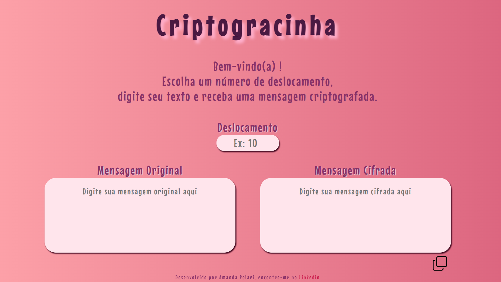

# Criptogracinha

## Índice

* [1. Resumo do projeto](#1-resumo-do-projeto)
* [2. Instalações](#2-instalações)
* [3. Iniciando](#3-iniciando)
* [4. Como testar](#4-como-testar)
* [5. Tecnologias utilizadas](#5-tecnologias-utilizadas)
* [6. Processo de desenvolvimento](#6-processo-de-desenvolvimento)
* [7. Veja em produção](#7-veja-em-produção)
***

## 1. Resumo do projeto

Criptogracinha utiliza a [cifra de César](https://pt.wikipedia.org/wiki/Cifra_de_C%C3%A9sar) para criptografar mensagens. O usuário precisa digitar um número para deslocamento e em seguida digita a sua mensagem na caixa mensagem original e recebe sua mensagem na caixa mensagem cifrada. 

Não há restrições para digitação de mensagem, o usuário pode digitar letras maiúsculas, minúsculas, números e caracteres especiais.

A mensagem cifrada aparece simultâneamente a sua digitação, sem a necessidade de um botão para realizar a cifragem ou decifragem




***

## 2. Instalações

### Ter instalado:
* node
* npm

***

## 3. Iniciando
* Para instalar as dependências no diretório do seu projeto execute:

```
npm install
```
* Para iniciar o aplicativo execute:
```
npm start
```

***


## 4. Como testar
* Para executar os testes, execute:
```
npm run test
```

***

## 5. Tecnologias utilizadas
Esse programa foi construído com:
* HTML
* CSS
* JavaScript

***

## 6. Processo de desenvolvimento
Registrei algumas etapas do desenvolvimento do algoritmo do projeto:

[Clique aqui para saber mais](./desenvolvimento.md)

## 7. Veja em produção
O link abaixo leva até o site

[Clique aqui para visualizar o site](https://amandapolari.github.io/SAP008-cipher/src/index.html)